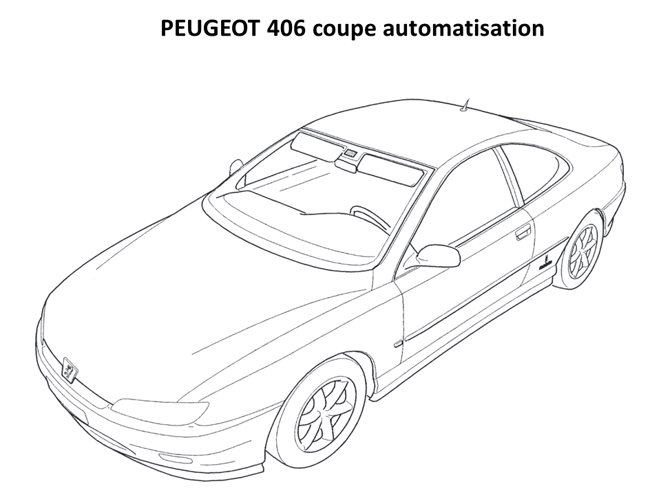
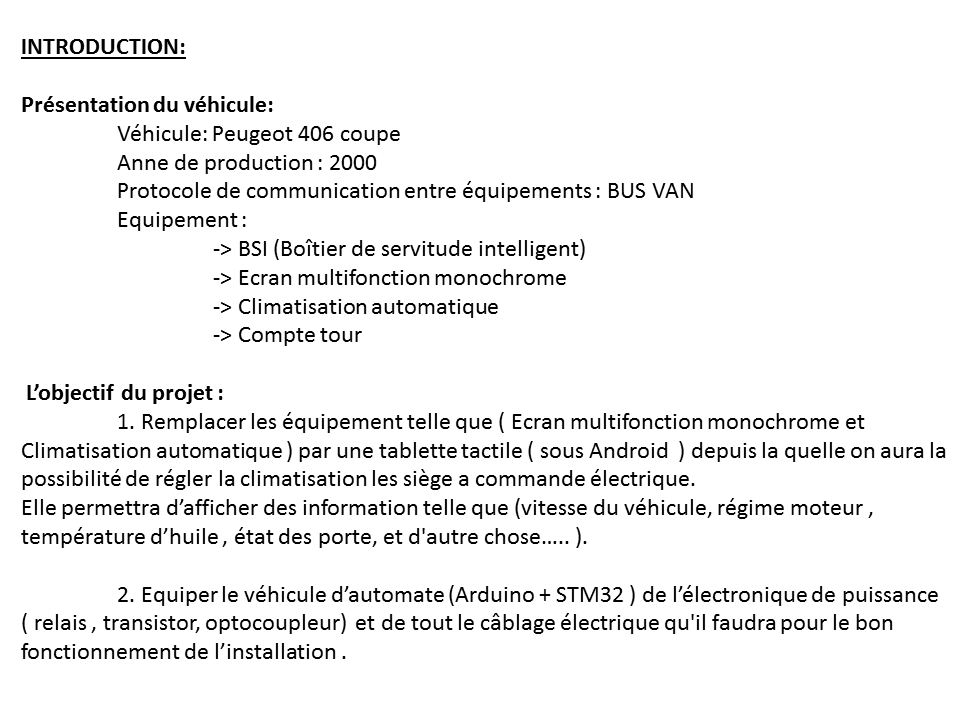
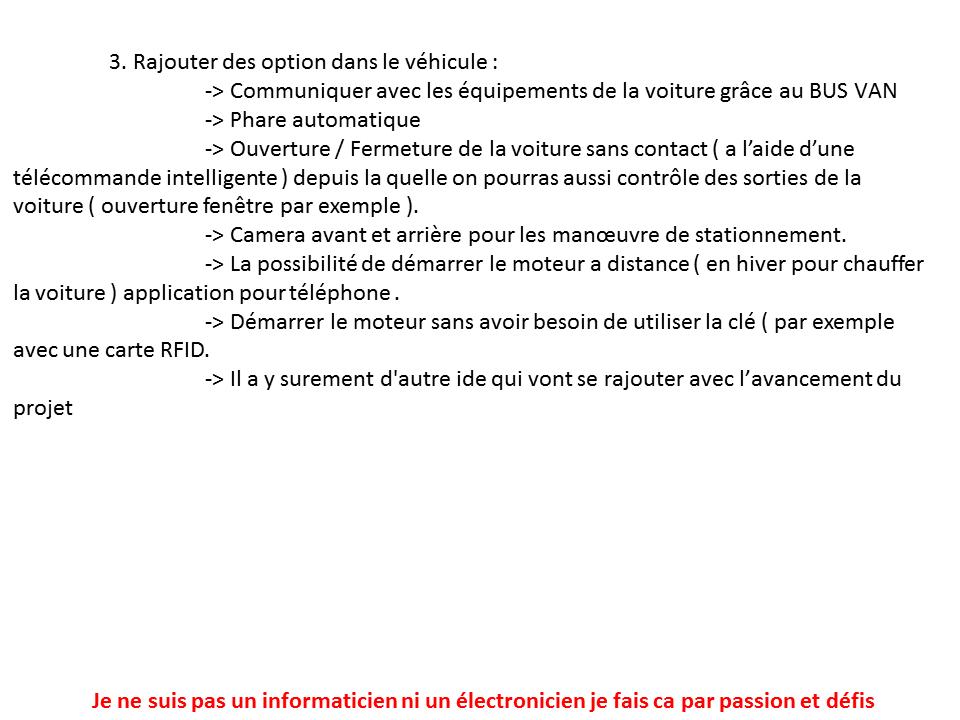
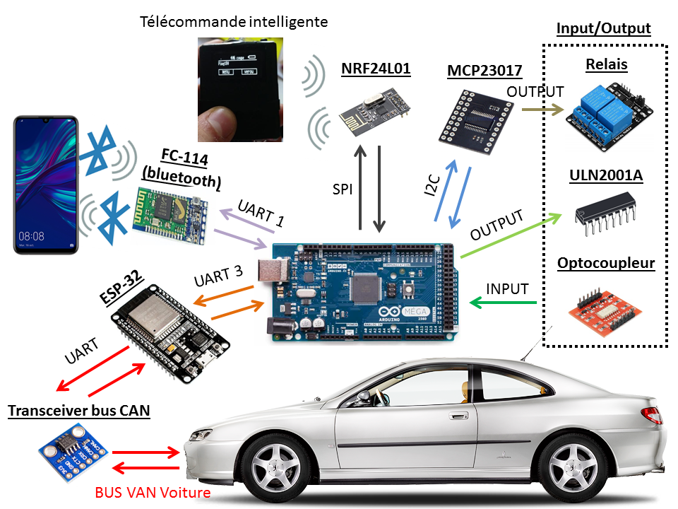
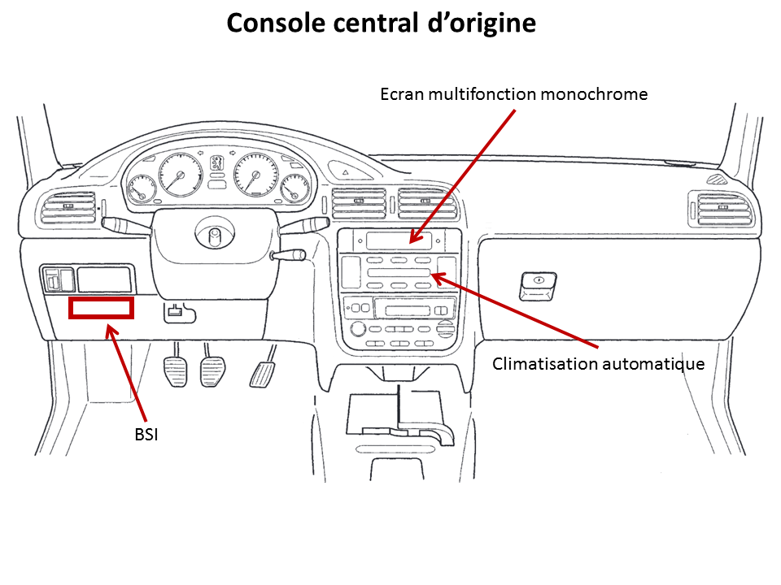
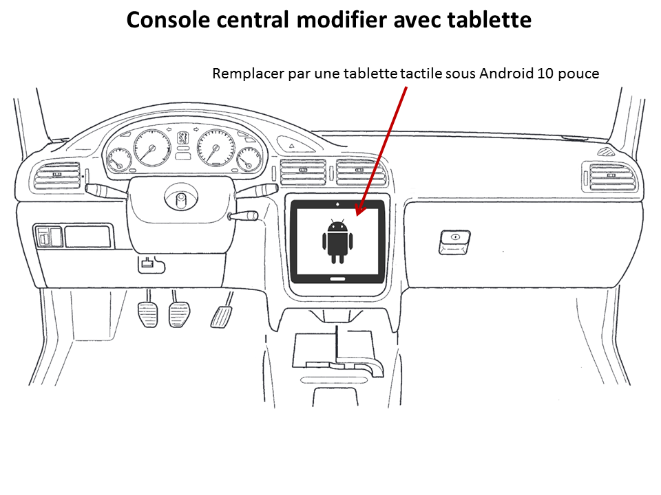
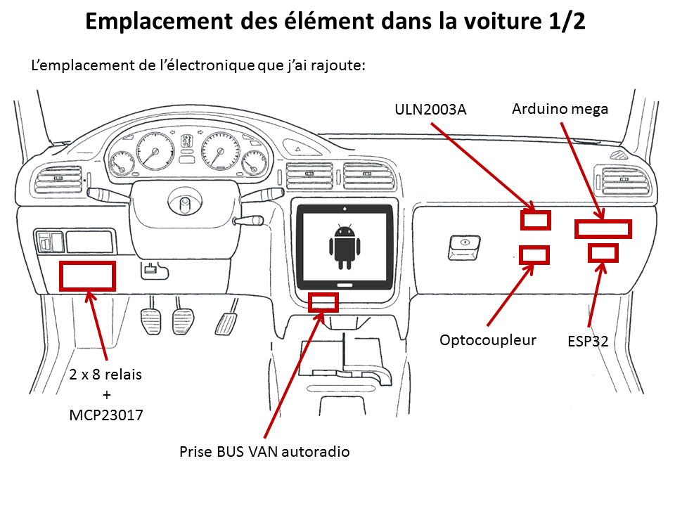
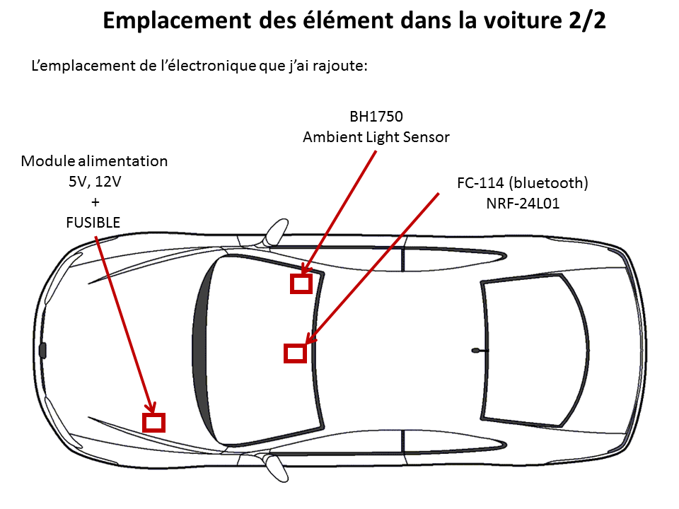

https://youtu.be/HWZzy4__-D0 <= Test <b> VAN BUS READER </b>, Un grand Merci a <b> Peter Pinter (morcibacsi)</b> pour sa bibliotheque https://github.com/morcibacsi/esp32_rmt_van_rx
 
https://youtu.be/f8XIpuNVmu4 <= Demmarer la voiture depuis un telephone.
 
https://youtu.be/ziEbgsZXHbA <= Peugeot 406 coupe contrôlé depuis un téléphone..
 
https://youtu.be/m1khf8ZqiCI <= Demmarage de la voiture avec une carte RFID.
 
https://youtu.be/2yEEObJ_j6c <= Lecture des donnes sur le bus van correspondant a l'ecran multifonction.

