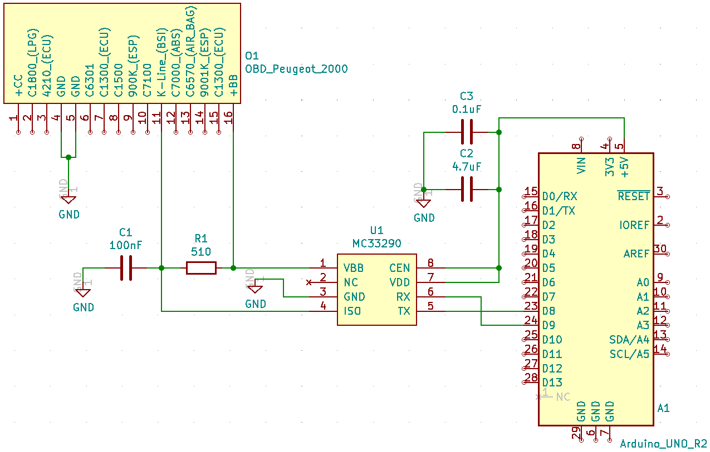
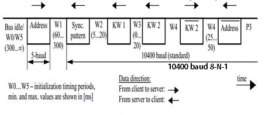
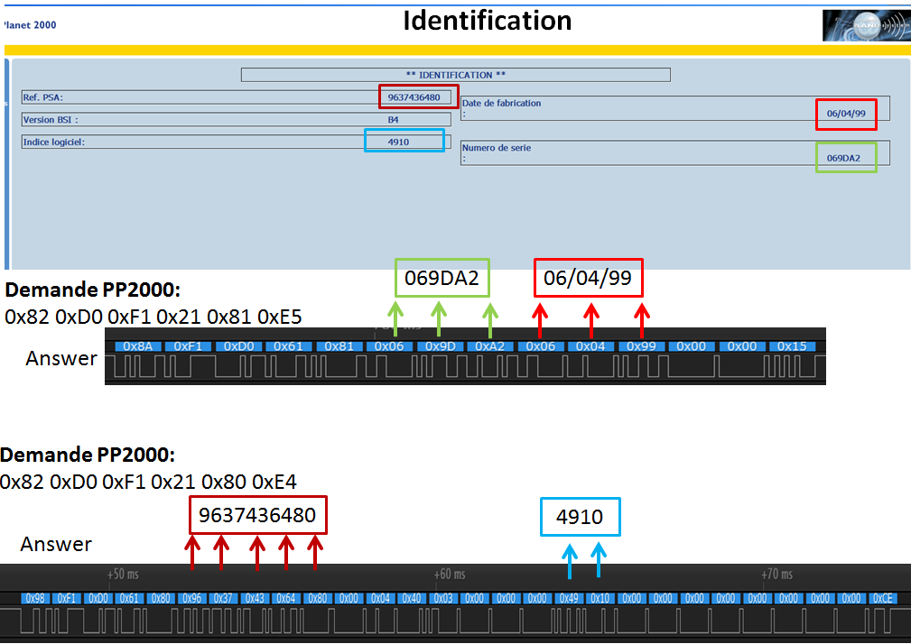
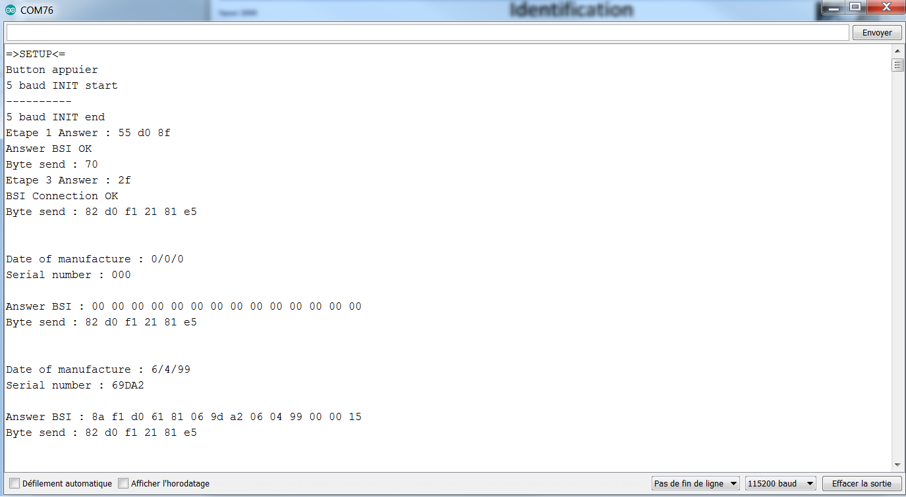

<h1>Arduino UNO K-Line protocol (OBD)<h1>

   

  
<h2>Hardware</h2>
  
 <b>Materiel utilise:</b> Arduino UNO + MC33290 (ISO K Line Serial Link Interface)
     
      
     
  

  
<h2>Initialisation de la communication</h2>
 

  

  

  
  
<h2>Software</h2>

  

  Pour me connecter au BSI de la voiture via la prise OBD je utilise le boitier diagnostic de peugeot ( PP2000 ) et sont logiciel ( peugeot        planet office ) il permet de lire tout les informations technique sur les equipements de la voiture.
  

  
  

   
  

   
  
Un essais avec ARDUINO UNO qui envoye une demande d'information au BSI sur ca version et ca date de fabrication. 

  
  

    
  

  
  <a href= "Software/Arduino_read_OBD_v1.01/Arduino_read_OBD_v1.01.ino" rel="nofollow"> =>Software Arduino_read_OBD_v1.01<= </a>
  
<h2>Documentation</h2>
  
Datasheet : 
    <a href= "RESOURCE/DataSheet/MC33290.pdf" rel="nofollow">MC33290</a>
   
  &emsp;&emsp;&emsp;&emsp;&emsp;
  <a href= "RESOURCE/DataSheet/IRJET-V4I7181.pdf" rel="nofollow">Protocol for Diagnostic Application ISO 9141</a>

 
 

